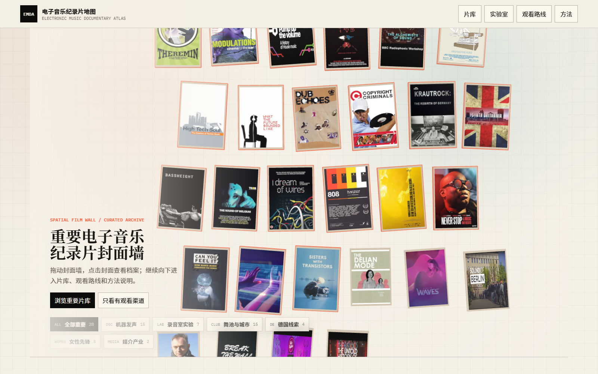
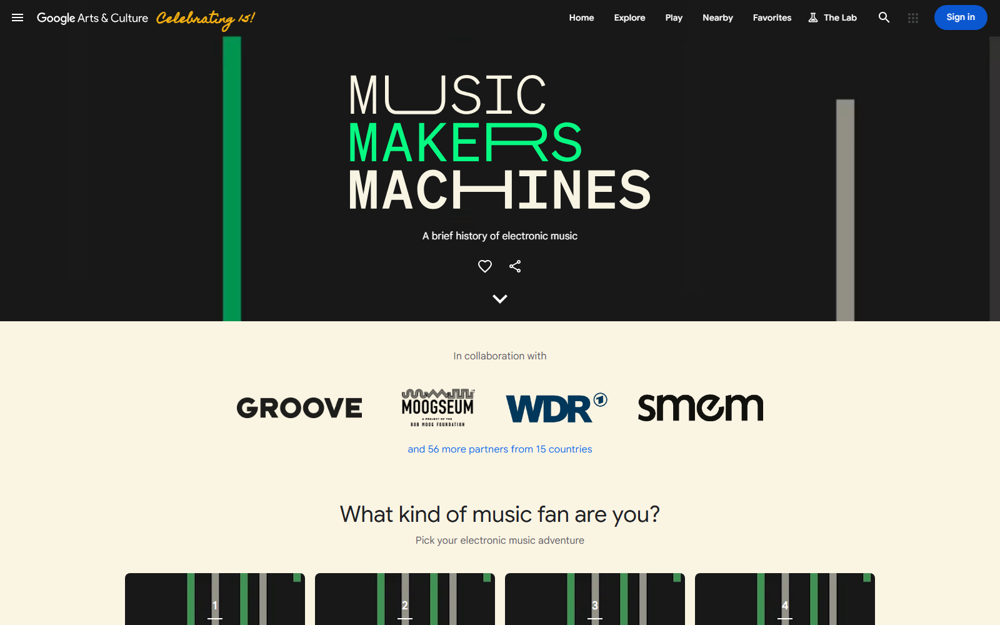
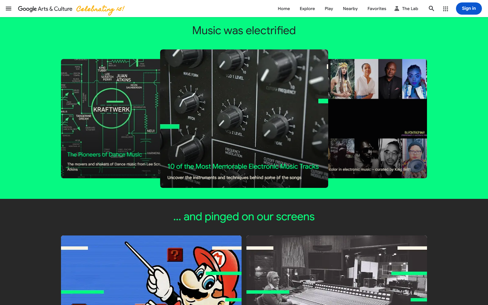
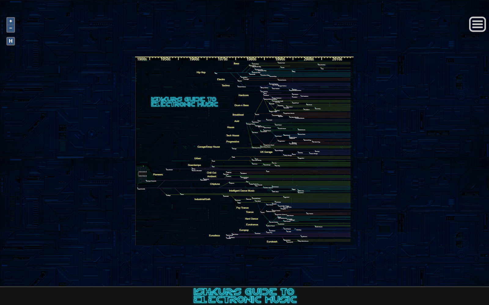
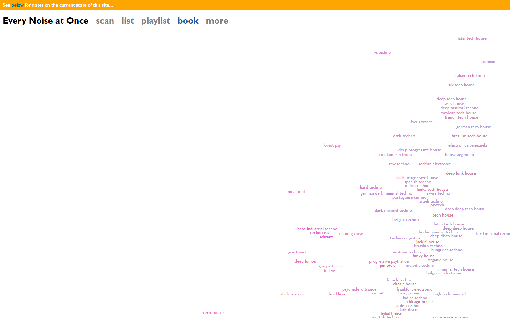
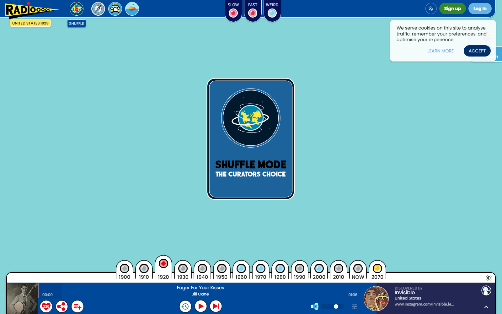
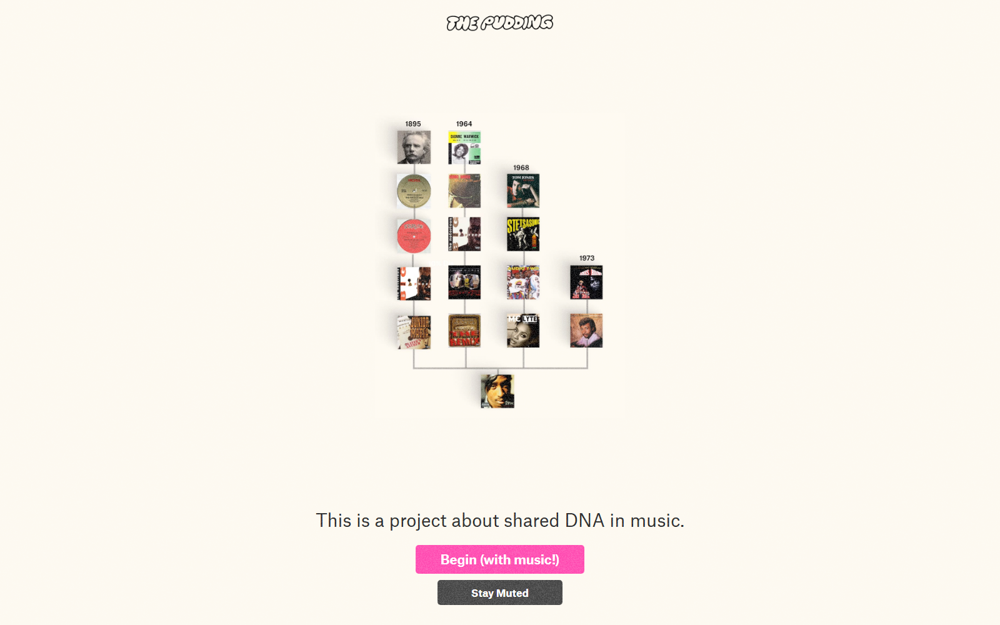
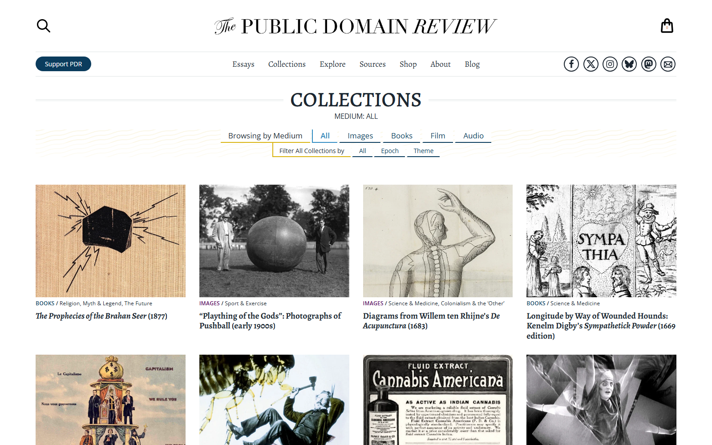

# 视觉策展案例研究：电子音乐纪录片地图

日期：2026-05-22

目标不是给现有页面换皮，而是重新判断这个网站应该更像什么：片库、展览、地图、声音实验室，还是几者的混合。当前版本最有潜力的是首页的封面墙，它已经有“空间里的影像档案”气质；问题是封面墙之后的内容仍然像表单、表格和资料卡，视觉节奏突然变平。

## 当前页面诊断

截图：

目前有效的部分：

- 封面墙比普通卡片网格更有记忆点，适合做首页第一屏。
- 方格浅色背景、黑字、红橙描边已经形成了一个“档案纸面 + 信号标记”的基础语言。
- 影片封面作为主体是正确的，它比节点、统计数字、抽象图形更能快速传达内容。

主要问题：

- 文字说明、按钮、路线筛选仍然是功能控件式排版，缺少策展页面里的叙事层次。
- 路线区像“分类入口”，不像“可进入的展览章节”。
- 片库卡片虽然可用，但还偏数据库展示；它应该作为第二层检索，而不是承担主要视觉吸引力。
- 详情弹窗目前是资料卡，不像影像档案的“dossier”；可读性有了，但缺少电影感和来源层级感。

## 案例 1：Google Arts & Culture - Music Makers & Machines

链接：https://artsandculture.google.com/project/music-makers-and-machines?hl=en

截图：

可借鉴点：

- 它不是把内容摊成列表，而是先建立一个强概念场景：黑底、竖线、机器感标题，立刻让人知道这是电子音乐历史。
- 每一段内容都有自己的背景色、图像组合和版式节奏，像连续进入不同展厅。
- 图片卡片有叠放、遮挡、层级和尺度变化，不是等宽等高的规整卡片。
- “你是哪种音乐迷”这种入口把分类变成选择路径，而不是传统筛选器。

对本项目的启发：

- “观看路线”不该只是一排路线卡，而应该升级为 5-6 个展览章节：入门、机器与录音室、舞池与城市、欧洲线索、女性先锋、媒介与采样。
- 每个章节可以有独立视觉场景：封面拼贴、关键词、代表影片、连接关系，而不是统一卡片模板。
- 首页第一屏可以继续保留封面墙，但下方应该进入“章节展厅”，而不是马上进入片库表单。

需要避免：

- 不要照搬 Google Arts 的大面积荧光绿。我们可以保留目前浅色档案纸面，再把高饱和色作为“信号色”穿插。
- 不要把每个区块都做成独立视觉特效，否则会分散纪录片本身。

## 案例 2：Ishkur's Guide to Electronic Music

链接：https://music.ishkur.com/

截图：

可借鉴点：

- 它把电子音乐史做成一个可缩放、可探索的谱系对象，而不是年表或文章。
- 类型、年代和关系线同时存在，适合表现“流派之间互相生成”的知识结构。
- 强风格界面让用户先产生探索欲，再慢慢读细节。

对本项目的启发：

- 我们可以保留一个“实验室/谱系层”，但它应该辅助影片之间的关系，而不是替代片库。
- 适合做成“线路图”或“声源图”：影片是入口，技术、城市、人物、流派是连接节点。
- 不宜把所有影片塞进复杂图谱，核心应是策展路线中的关键连接。

需要避免：

- Ishkur 的信息密度非常高，文字极小；我们的目标用户还要读简介、找片源，不能牺牲可读性。

## 案例 3：Every Noise at Once

链接：https://everynoise.com/

截图：

可借鉴点：

- 标签不是列表，而是一个空间分布。用户会自然地感到某些风格接近、某些风格远离。
- 它证明“检索”可以不必长得像表单，也可以像地图。

对本项目的启发：

- 当前片库里的 tag 区可以降级为“资料库筛选”，但在首页或实验室里，主题词可以变成漂浮的关键词星图。
- 点击“Detroit / Synth-pop / Radiophonic Workshop / Sampling”这类词时，可以让相关封面在墙上聚拢，而不是仅仅刷新卡片列表。

需要避免：

- Every Noise 的页面更像内部工具，视觉并不适合直接作为公共策展页。

## 案例 4：Radiooooo

链接：https://radiooooo.com/

截图：

可借鉴点：

- 年代、地区、播放状态都被做成“仪表盘/播放器”式交互，比表单更像音乐体验。
- 它把档案浏览变成操作一台装置：点国家、转年代、按播放。

对本项目的启发：

- “观看路线”可以借鉴它的装置感：不是下拉选择，而是路线按钮、信号拨片、胶片轨道、频道切换。
- 片库页仍可保留搜索，但首页的主交互应更像“调频、接线、选台”。

需要避免：

- Radiooooo 偏玩具化。本项目更适合“档案实验室 + 影像展览”，不能变成过度拟物的播放器。

## 案例 5：The Pudding - Music DNA

链接：https://pudding.cool/2025/04/music-dna/

截图：

可借鉴点：

- 它用一个核心视觉模型承载叙事，而不是在页面上堆很多组件。
- 开始按钮很明确：先进入体验，再逐步展开解释。
- 音乐关系用“血缘/传承”的隐喻表达，用户不用先读一大段说明也能理解。

对本项目的启发：

- 可以为每条观看路线设计一个“核心隐喻”：入门是导览台，机器与录音室是 patch bay，舞池与城市是夜间城市地图，女性先锋是被重新接入的信号谱系。
- 每条路线不需要展示所有片，只展示 4-6 部关键片和它们之间的理由；完整片库放到下层。

需要避免：

- The Pudding 的叙事依赖清晰数据模型。我们目前是策展判断，不应制造未经验证的因果关系。

## 案例 6：The Public Domain Review - Collections

链接：https://publicdomainreview.org/collections/

截图：

可借鉴点：

- 它的价值在于“档案层”：清晰、稳重、图像优先，筛选项不喧宾夺主。
- 图片网格有足够留白，标题和元信息克制，适合用户认真查找。

对本项目的启发：

- 片库页可以向这个方向靠：更紧凑但不拥挤，图片是第一信息，筛选是轻量工具。
- 它适合成为“资料库层”的参考，不适合成为首页主视觉参考。

## 与当前 EMDA 的对比

| 维度 | 当前 EMDA | 参考案例启发 | 建议 |
| --- | --- | --- | --- |
| 第一印象 | 封面墙有冲击力，但文字和按钮还像说明页 | Google Arts 先建立展览场景 | 首页只保留少量文字，把封面墙放到绝对主角位置 |
| 路线呈现 | 六个路线卡偏静态 | Google Arts / Pudding 把路线变成章节体验 | 路线改为“策展章节”，每章有独立视觉场景 |
| 分类筛选 | tag 很多，像后台筛选 | Every Noise / Radiooooo 把筛选空间化、装置化 | 首页用关键词聚合或信号控制；片库页保留实用筛选 |
| 信息深度 | 详情卡像资料条目 | Public Domain Review 的档案层更稳 | 详情做成影像 dossier：简介、事实、观看渠道、来源分层 |
| 互动方式 | 可点击，但动作偏工具化 | Radiooooo / Ishkur 更像操作一台装置 | 增加拖拽、聚拢、章节切换、封面浮出等动作反馈 |

## 推荐方向

推荐采用“影像展览 + 档案库 + 实验室”的三层结构：

1. 首页：Spatial Film Wall 继续作为主视觉，但文字退后，只保留项目名、短句和两个入口。封面墙可以作为可拖拽展墙，点击封面弹出轻量浮窗，再进入详细档案。
2. 策展章节：替换现在板正的观看路线区。每条路线是一段横向或纵向展厅场景，包含代表封面、关键词、简短策展语和“进入路线”操作。
3. 片库：作为可靠检索层，保留搜索、tag、排序和详情卡，但视觉更紧凑，降低它在首页中的权重。
4. 实验室：保留 React + Three.js，但定位为“探索关系”的附加入口，不承担主叙事。

## 可以先做的原型

下一步不建议整体重写。建议先做一个小而清晰的视觉原型：

- 只改造“观看路线”这一屏，做成 5-6 个策展章节的展厅式布局。
- 每个章节只放 4-6 部代表影片，避免 Modulations 这类影片在太多路线里重复出现。
- 每章使用不同的视觉隐喻，但共享同一套组件：大标题、封面组、关键词、代表影片、进入按钮。
- 完成后再决定是否把 tag 星图或 patch cable 关系层接入。

## 截图目录

本次截图保存在：

`docs/visual-references/screenshots/`

主要文件：

- `current-emda-home.png`
- `google-arts-music-makers-hero-clean.png`
- `google-arts-music-makers-cards-clean.png`
- `ishkur-guide.png`
- `every-noise.png`
- `radiooooo-map.png`
- `pudding-music-dna.png`
- `public-domain-review-collections-clean.png`

